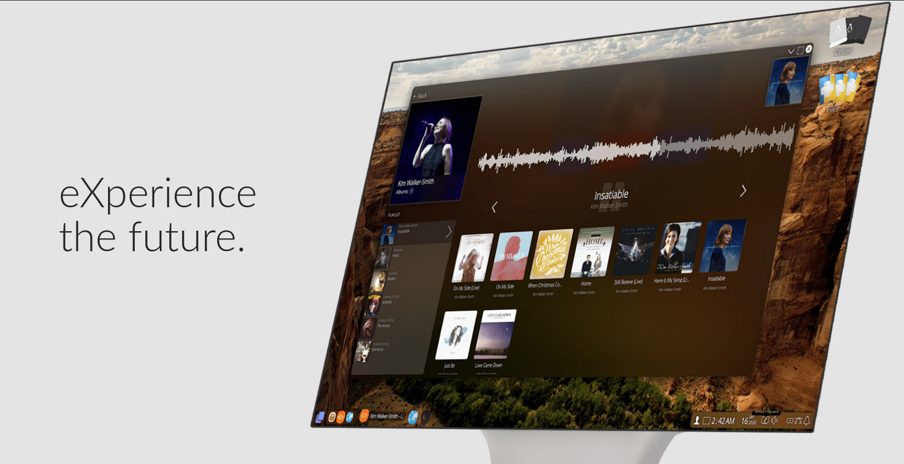

# eXternOS-Base

(Work in progress in terms of adding the files from the filesystem.)

This repository containts the filesystem base as it comes in the releases of eXtern OS. That includes everything that's compiled for distribution. Apps and components in this OS have been seperated into each of their own repositories. Once a release is ready the Apps and component resources are then updated here. Also note that live-iso/casper/filesystem.squashfs is missing as thats not necessary, it's too big for pulls and such, you can get it from the release ISOs (or can be generated from the filestsyem).

## Related Repositories

All other repositories for each of the sub-projects for eXtern OS can be found here: https://github.com/eXtern-OS/

[eXtern OS Official Website](https://externos.io)

